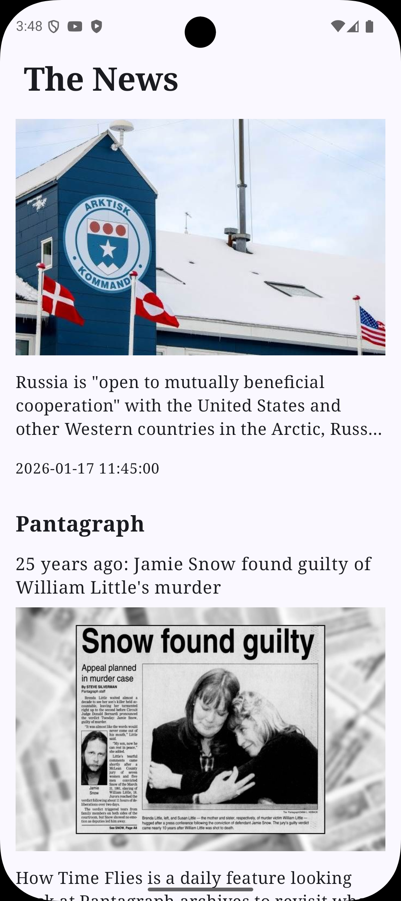
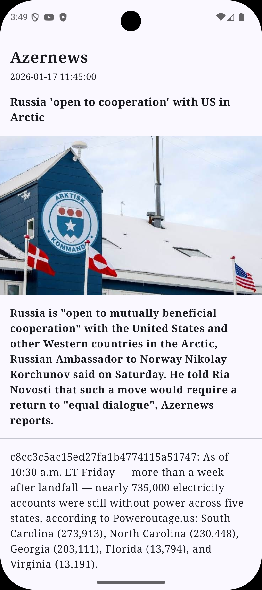

# 📰 News App (Android)

## Overview
A modern Android news application built with **Kotlin** and **Jetpack Compose**.  
The app fetches and displays news articles from a remote API and supports **offline access** through local caching.

This project focuses on clean architecture, scalability, and modern Android development best practices.

---

✨ Features
- Latest news feed with headlines and images
- Article details screen with full content
- Offline caching using Room database
- Loading, empty, and error state handling
- Clean and modular MVVM architecture
- Responsive UI built with Jetpack Compose

---

## 🛠 Tech Stack
- Kotlin
- Jetpack Compose
- MVVM Architecture
- Room Database
- Repository Pattern
- Coroutines & Flow

---

## 📱 Screenshots

  
  

  News Feed (left) · Article Details (right)

---

## 🚀 How to Run
1. Clone the repository  
2. Open the project in **Android Studio**  
3. Sync Gradle  
4. Run on an emulator or physical device
